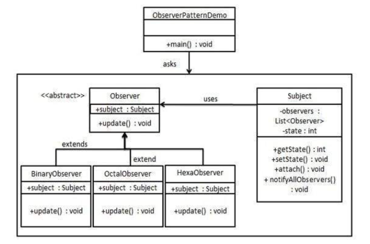

## 观察者(observer)模式

### 模式简介
```
观察者模式定义了对象之间的一对多依赖关系。当被观察对象（Subject）的状态发生改变时，所有依赖它的观察者（Observer）都会收到通知并自动更新。

- 结构
* Subject（被观察者）
维护一个观察者列表。
提供注册、移除观察者的方法。
当状态发生变化时，通知所有观察者。

* Observer（观察者）
定义一个更新接口，用于接收被观察者的通知。
具体观察者实现更新逻辑。

* ConcreteSubject（具体被观察者）
继承自 Subject，维护具体状态。
当状态变化时，通知所有观察者。

* ConcreteObserver（具体观察者）
实现 Observer 接口，定义具体的更新行为。
```


