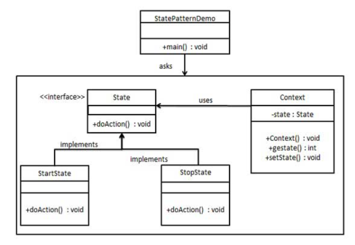

## 状态(state)模式

### 模式简介
```
State 允许对象在其内部状态发生改变时，改变其行为。换句话说，状态模式让一个对象的行为取决于其状态，并在状态发生变化时动态切换。

- 结构

* Context（上下文类）
维护一个当前状态对象的引用。
定义客户端可以直接调用的接口。
将客户端的请求委托给当前的状态对象处理。

* State（状态接口）
定义所有具体状态类的接口。
声明与上下文类相关的行为。

* ConcreteState（具体状态类）
实现状态接口的具体类。
每个具体状态类实现特定的行为，并在需要时切换上下文的状态。
```

