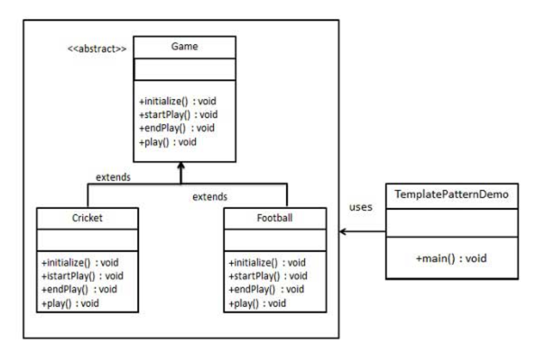

## 模版(template)模式

### 模式简介
```
模板模式（Template Pattern）通过在抽象类中定义算法的框架（即模板方法），并允许其子类实现具体步骤的方式，控制代码的执行流程。
这种模式保证了算法的整体结构一致，同时允许子类根据需求定制某些步骤。

- 结构
* 抽象类（AbstractClass）：
包含模板方法和通用实现。
模板方法调用一系列子类可以实现的方法。

* 具体类（ConcreteClass）：
继承抽象类并实现其抽象方法，定制具体的行为。
```

