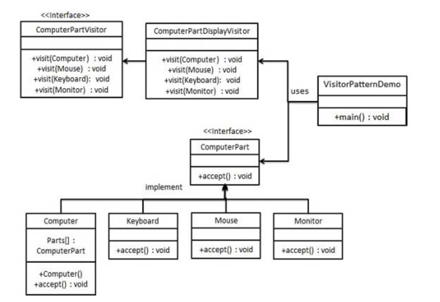

## 访问者(visitor)模式

### 模式简介
```
访问者模式（Visitor Pattern）允许我们在不改变对象结构的情况下，为对象结构添加新的功能。
访问者模式通过引入“访问者”类，将操作的逻辑从对象的结构中分离出来，从而实现操作逻辑的扩展。

- 模式结构
* 元素接口（Element Interface）：
定义了 accept 方法，用于接受访问者对象。

* 具体元素类（Concrete Element Classes）：
实现元素接口，并在 accept 方法中调用访问者的对应方法。

* 访问者接口（Visitor Interface）：
定义了访问不同元素的方法。

* 具体访问者类（Concrete Visitor Classes）：
实现访问者接口，提供具体操作的实现。

* 对象结构（Object Structure）：
包含元素集合，允许访问者遍历这些元素。
```

