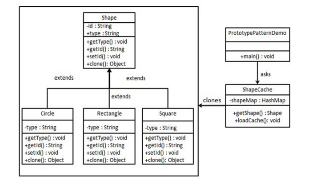

## prototype 模式
### 模式简介
```
“Creating duplicate object while keeping performance in mind”：
原型模式关注于在创建对象时通过复制现有对象来生成新的实例，而不是通过实例化一个类。
这种方式特别注重性能，因为复制对象（通常是浅拷贝或深拷贝）比重新创建一个对象在某些场景下更高效，比如需要创建大量相似对象的场景。
```
