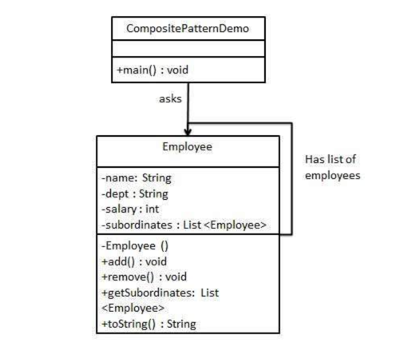

## composite模式

### 模式简介
* 对象的组合处理：Composite模式通过创建包含自己对象的类来实现对象的组合。例如，你可以有一个父类或接口（通常称为Component），然后有具体实现（Leaf）和组合节点（Composite）。组合节点可以包含多个Leaf或其他Composite对象，从而构成一个树形结构。通过这种方式，无论是处理单个对象（Leaf）还是整个组合对象（Composite），都可以通过统一的接口进行操作。
* 树形结构：这个模式强调以树的形式组织对象。树的节点可以是叶子节点（代表单一对象）或非叶子节点（代表多个对象的组合）。这样，当我们操作整个树结构时，可以递归地处理其所有子节点，实现“部分-整体”一体化的操作。
* 适用场景：在需要将一组复杂的对象和单一对象进行统一处理的情况下，可以考虑使用Composite模式。它特别适用于表示层次结构的场景，如文件系统、组织架构、GUI组件等。

