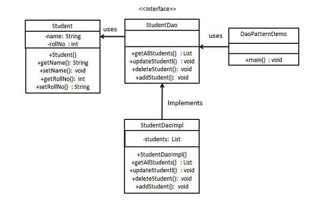

## dao模式

### 模式简介
```
Data Access Object Pattern (DAO) 是一种结构化设计模式，用于将低层次的数据访问逻辑与高层次的业务逻辑分离。它通过抽象数据访问层，减少代码的耦合性，提高代码的可维护性和可测试性。这种模式通常在分层架构中应用，特别是当需要与数据库或其他持久化存储交互时。

DAO 模式包括以下几个关键参与者：
- Data Access Object Interface (数据访问接口)
定义了访问持久化存储的标准操作方法。
通常包括 CRUD 操作（Create, Read, Update, Delete）及其他查询方法。
接口隐藏了具体的数据访问实现细节，为业务逻辑提供了统一的访问点。

- Data Access Object Implementation (数据访问实现)
具体实现了 DAO 接口中定义的操作。
包含具体的数据库交互逻辑（如 SQL 查询）。
将底层技术细节（如 JDBC、JPA 或 Hibernate）与业务逻辑隔离。

- Model Object or Value Object (模型对象或值对象)
表示一个数据库表中的记录或一个业务实体。
通常是简单的 POJO（Plain Old Java Object），包含数据字段及其 getter 和 setter 方法。

- Business Object (业务对象)
使用 DAO 来完成业务逻辑操作。
DAO 层为业务对象提供数据访问服务，而业务对象则关注业务逻辑实现。
```

