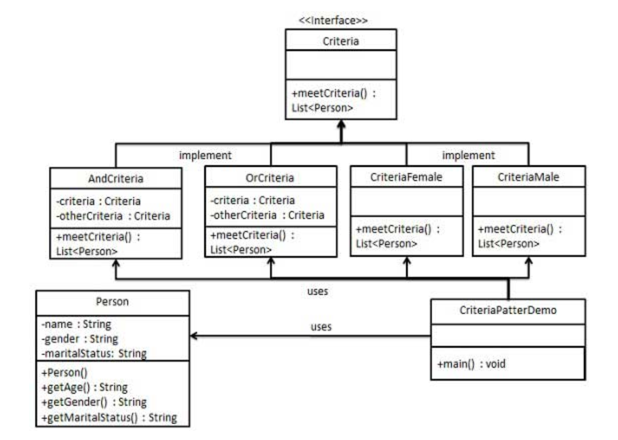

## filter模式

### 模式简介

* 基本概念：Filter模式允许我们定义一组标准（Criteria），并将它们组合成复杂的过滤逻辑。这样一来，我们可以通过不同的条件来过滤集合中的对象，并且不需要把过滤的逻辑硬编码在一个类中，而是通过将多个标准组合在一起实现灵活的筛选。
* 解耦和复用：通过使用Filter模式，可以将不同的过滤逻辑独立开来，使它们可以单独实现、测试和复用。多个过滤器可以通过与（AND）、或（OR）等逻辑运算进行组合，这种组合是解耦的，可以根据需要进行动态调整，而不需要修改已有的代码。
* 结构性优势：这个模式通过结构性的组织方式，避免了条件判断的硬编码，使得代码更具扩展性和可维护性。例如，我们可以定义一个Criteria接口及其多个具体实现类，每个实现类代表一个特定的过滤条件，然后通过组合不同的Criteria实例来实现复杂的过滤逻辑。

