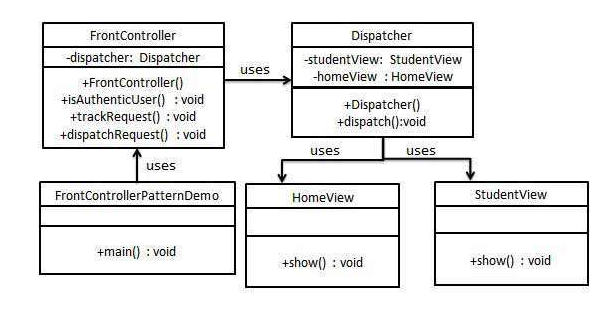

## frontController模式

### 模式简介
```
Front Controller Design Pattern 是一种 结构型设计模式，用于提供 集中化的请求处理机制。这种模式确保了所有的客户端请求都通过一个 单一的入口点（通常称为 Front Controller）来处理，而不是直接调用具体的处理器。

设计模式的核心思想
提供一个统一的入口来处理请求。
将 认证、授权、日志记录、跟踪等 通用功能 集中在一个位置，避免在每个处理器中重复实现这些功能。
Front Controller 负责将客户端请求分发给适当的处理程序（Handler）。

核心组件
- Front Controller（前端控制器）
负责接收所有客户端请求。
作为单一入口点，用于集中化处理常见任务（如日志、认证等）。
解析请求并决定将其转发到哪个处理器（Handler）。

- Dispatcher（调度器）
Front Controller 的助手。
根据请求，将其分发到具体的处理器（例如：视图、控制器）。
包含了具体处理器的引用。

- Handlers（处理器）
负责具体任务的执行。
每个处理器专注于一个特定的功能或视图。

- Client（客户端）
发送请求到 Front Controller。
```

