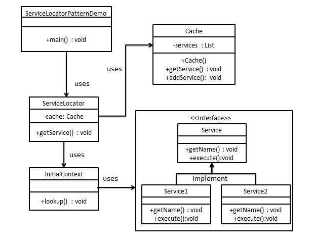

## 代理(proxy)模式

### 模式简介
```
背景和目的
在复杂的分布式应用中，服务是通过 JNDI (Java Naming and Directory Interface) 查找的，JNDI 查找操作可能会耗费较多资源。
服务定位器模式的目标是通过引入缓存机制，减少重复的服务查找操作，从而提高应用程序的性能。
核心思想

初次访问服务时，Service Locator 会通过 JNDI 进行查找并将服务对象缓存起来。
后续访问相同服务时，会直接从缓存中返回结果，而无需重复执行 JNDI 查找。

核心组成

- Service Interface（服务接口）
定义服务的通用接口，所有具体服务都实现该接口。

- Concrete Service（具体服务）
实现服务接口的具体类，提供服务的实际业务逻辑。

- InitialContext（初始上下文）
模拟 JNDI 查找的环境，负责从 JNDI 或其他源中获取服务实例。

- Cache（缓存）
用于存储已查找过的服务实例，以避免重复查找操作。

- Service Locator（服务定位器）
核心组件，负责协调服务的查找和缓存的使用。
```



