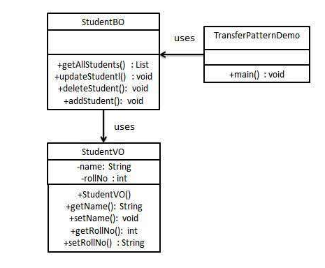

## TransferObject模式

### 模式简介
```
Transfer Object Pattern（传输对象模式） 是一种设计模式，主要用于在客户端和服务器之间传递具有多个属性的数据。它的设计意图是优化网络通信，减少方法调用的次数，从而提高性能。

模式的核心概念
- Transfer Object（传输对象）：
也称为 Value Object（值对象）。
是一个简单的 POJO（Plain Old Java Object）。
包含多个属性，通过 getter 和 setter 方法访问属性。
实现了 Serializable 接口，以便在网络上传输。
不包含业务行为，仅用来封装数据。

- Server Side（服务器端）：
服务器端的业务类通常会从数据库中获取数据，填充到传输对象中，并将其传递给客户端。
对服务器而言，传输对象可能是可变的，但通常只用来返回数据给客户端。

- Client Side（客户端）：
对客户端来说，传输对象是只读的。
客户端也可以创建传输对象，并将其发送到服务器端，用于一次性更新数据库中的数据。
```



